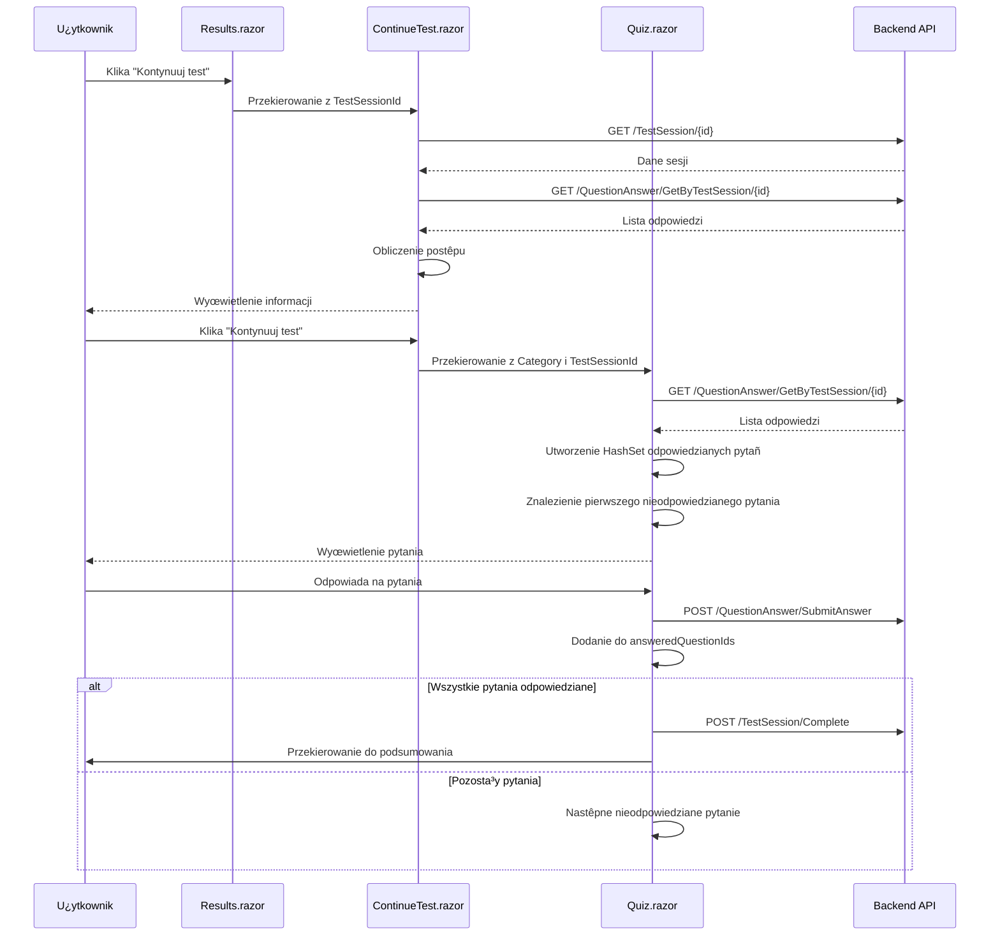

# Funkcjonalnoœæ kontynuacji nieukoñczonych testów

## Przegl¹d
System umo¿liwia zalogowanym u¿ytkownikom kontynuowanie nieukoñczonych testów na prawo jazdy. Nieukoñczone testy s¹ wyœwietlane w sekcji "Moje Wyniki" z mo¿liwoœci¹ ich wznowienia od momentu przerwania.

## Architektura rozwi¹zania

### 1. Model danych
- **TestSession** - przechowuje informacje o sesji testowej (StartDate, EndDate, Result, UserId)
- **QuestionAnswer** - przechowuje odpowiedzi u¿ytkownika na poszczególne pytania
- **TestSessionResultDto** - DTO z dodatkowymi w³aœciwoœciami:
  - `IsCompleted` - sprawdza czy test zosta³ ukoñczony (EndDate.HasValue && Result.HasValue)
  - `IsPassed` - sprawdza czy test zosta³ zaliczony (IsCompleted && Result >= 68)
  - `IsFailed` - sprawdza czy test zosta³ niezaliczony (IsCompleted && Result < 68)

### 2. Warstwa API (Backend)

#### TestSessionController
- **GET /TestSession/GetByUserId/{userId}** - pobiera wszystkie sesje u¿ytkownika (ukoñczone i nieukoñczone)
- **GET /TestSession/Details/{testSessionId}** - pobiera szczegó³y sesji z liczb¹ odpowiedzi
- **POST /TestSession/Create** - tworzy now¹ sesjê testow¹
- **POST /TestSession/Complete** - koñczy sesjê testow¹ z wynikiem

#### QuestionAnswerController
- **GET /QuestionAnswer/GetByTestSession/{testSessionId}** - pobiera wszystkie odpowiedzi dla danej sesji
- **POST /QuestionAnswer/StartQuestion** - rozpoczyna œledzenie pytania
- **POST /QuestionAnswer/SubmitAnswer** - zapisuje odpowiedŸ u¿ytkownika

### 3. Warstwa prezentacji (Frontend)

#### Strona wyników (/wyniki)
**Komponenty:**
- `Results.razor` - wyœwietla listê wszystkich testów u¿ytkownika
- `Results.razor.cs` - logika biznesowa strony
- `Results.razor.css` - stylowanie

**Funkcjonalnoœci:**
- Wyœwietlanie statystyk (ukoñczone, zaliczone, niezaliczone, nieukoñczone)
- Lista testów z kolorowym oznaczeniem statusu (zielony/czerwony/fioletowy)
- Przycisk "Kontynuuj test" dla nieukoñczonych testów
- Przycisk "Zobacz szczegó³y" dla ukoñczonych testów

#### Strona kontynuacji testu (/continue-test/{testSessionId})
**Komponenty:**
- `ContinueTest.razor` - strona podsumowania przed kontynuacj¹
- `ContinueTest.razor.cs` - logika ³adowania danych sesji
- `ContinueTest.razor.css` - stylowanie

**Funkcjonalnoœci:**
- Wyœwietlenie informacji o teœcie (data rozpoczêcia, kategoria, postêp)
- Pasek postêpu pokazuj¹cy ile pytañ zosta³o ju¿ odpowiedzianych
- Przycisk kontynuacji przekierowuj¹cy do quizu
- Walidacja czy test nie zosta³ ju¿ ukoñczony

#### Strona quizu (/quiz/{Category}/{TestSessionId?})
**Komponenty:**
- `Quiz.razor` - interfejs quizu
- `Quiz.razor.cs` - rozszerzona logika obs³uguj¹ca kontynuacjê

**Nowe w³aœciwoœci:**
```csharp
[Parameter] public string? TestSessionId { get; set; }
private bool isContinuingTest = false;
private HashSet<string> answeredQuestionIds = new();
```

**Proces kontynuacji:**
1. Sprawdzenie czy TestSessionId jest przekazany
2. Za³adowanie istniej¹cych odpowiedzi z bazy danych
3. Zapisanie ID pytañ, które ju¿ maj¹ odpowiedzi
4. Pominiêcie odpowiedzianych pytañ podczas nawigacji
5. Automatyczne zakoñczenie testu gdy wszystkie pytania maj¹ odpowiedzi

### 4. Przep³yw kontynuacji testu



### 5. Obs³uga stanów

#### Stan nieukoñczony
- `EndDate == null` lub `Result == null`
- Lewa krawêdŸ karty: fioletowa
- Badge: "Nieukoñczony"
- Akcja: "Kontynuuj test"

#### Stan ukoñczony - zaliczony
- `IsCompleted == true` && `Result >= 68`
- Lewa krawêdŸ karty: zielona
- Badge: "Zaliczony"
- Akcja: "Zobacz szczegó³y"

#### Stan ukoñczony - niezaliczony
- `IsCompleted == true` && `Result < 68`
- Lewa krawêdŸ karty: czerwona
- Badge: "Niezaliczony"
- Akcja: "Zobacz szczegó³y"

### 6. Wzorce projektowe wykorzystane w rozwi¹zaniu

#### Repository Pattern
- `ITestSessionRepository` i `TestSessionRepository`
- `IQuestionAnswerRepository` i `QuestionAnswerRepository`
- Separacja logiki dostêpu do danych od logiki biznesowej

#### DTO Pattern
- `TestSessionResultDto` - transfer danych miêdzy warstwami
- Enkapsulacja logiki obliczania statusów

#### Strategy Pattern (implicit)
- Ró¿ne strategie obs³ugi testów (nowy vs kontynuacja)
- Warunkowa logika w `Quiz.razor.cs`

#### Dependency Injection
- Wstrzykiwanie `HttpClient`, `NavigationManager`, `AuthenticationStateProvider`
- Loose coupling miêdzy komponentami

### 7. Bezpieczeñstwo

- **Autoryzacja** - wszystkie operacje wymagaj¹ zalogowania u¿ytkownika
- **Walidacja w³aœciciela** - backend sprawdza czy sesja nale¿y do u¿ytkownika
- **Ochrona przed duplikacj¹** - kontrola czy pytanie nie ma ju¿ odpowiedzi

### 8. Optymalizacje

- **Caching** - pytania i pliki mediów s¹ cache'owane lokalnie
- **Lazy loading** - media ³adowane tylko dla aktualnego pytania
- **HashSet** - szybkie wyszukiwanie odpowiedzianych pytañ (O(1))
- **Bulk operations** - zbiorcze zapisywanie odpowiedzi dla niezalogowanych u¿ytkowników

### 9. Testowanie

#### Scenariusze testowe:
1. Rozpoczêcie nowego testu jako zalogowany u¿ytkownik
2. Przerwanie testu w po³owie
3. Powrót do listy wyników i kontynuacja testu
4. Ukoñczenie testu po kontynuacji
5. Próba kontynuacji ju¿ ukoñczonego testu (przekierowanie do podsumowania)
6. Próba dostêpu do nieistniej¹cej sesji testowej

## Wykorzystanie

### Dla u¿ytkownika koñcowego:
1. Zaloguj siê do systemu
2. Rozpocznij test wybieraj¹c kategoriê
3. Jeœli potrzebujesz przerwaæ test, po prostu zamknij stronê lub przejdŸ do innej
4. Wróæ do "Moje Wyniki"
5. ZnajdŸ nieukoñczony test (oznaczony fioletowym kolorem)
6. Kliknij "Kontynuuj test"
7. SprawdŸ informacje o postêpie
8. Kliknij "Kontynuuj test" aby wróciæ do quizu
9. Test automatycznie pominie ju¿ odpowiedziane pytania
10. Zakoñcz test odpowiadaj¹c na pozosta³e pytania

### Dla developera:
```csharp
// Sprawdzenie czy test jest nieukoñczony
if (!result.IsCompleted) {
    // Wyœwietl opcjê kontynuacji
}

// Kontynuacja testu
Navigation.NavigateTo($"/quiz/{category}/{testSessionId}");

// W Quiz.razor.cs test automatycznie wykryje kontynuacjê
if (!string.IsNullOrEmpty(TestSessionId)) {
    isContinuingTest = true;
    await LoadExistingTestSession();
}
```

## Przysz³e rozszerzenia

1. **Auto-save** - automatyczne zapisywanie postêpu co N sekund
2. **Offline mode** - mo¿liwoœæ kontynuacji bez po³¹czenia internetowego
3. **Multi-device sync** - synchronizacja postêpu miêdzy urz¹dzeniami
4. **Time tracking** - œledzenie czasu spêdzonego na ka¿dym pytaniu
5. **Analytics** - statystyki dotycz¹ce porzuconych testów
